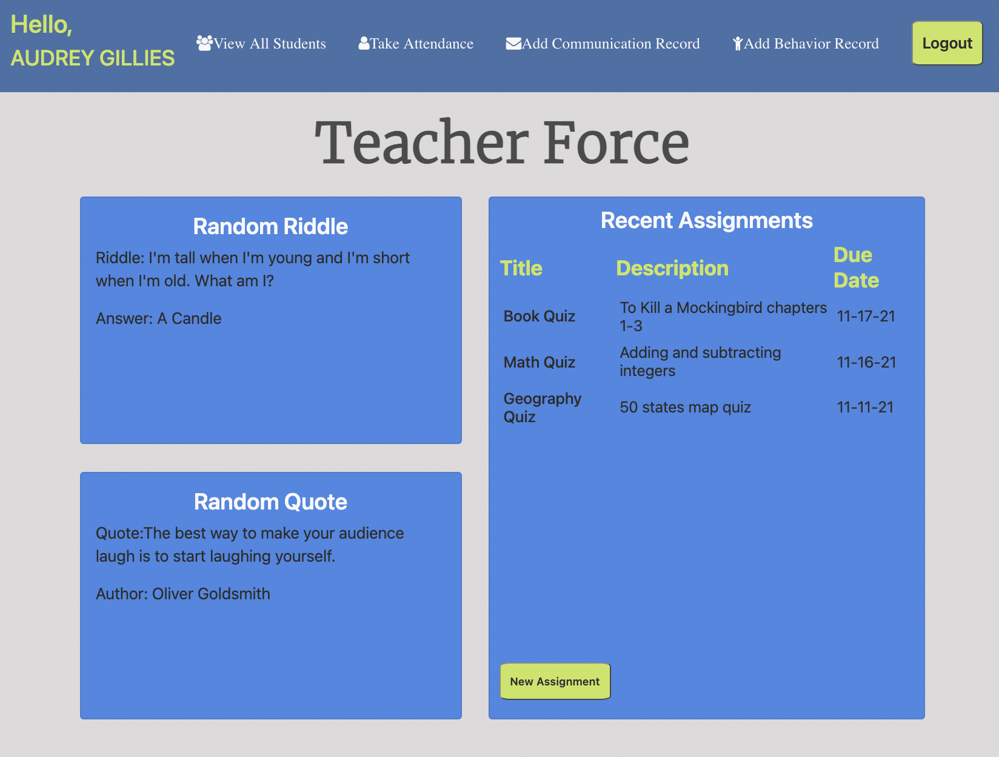

# Teacher Verse 

## Description

An app designed for teachers where they can add students, guardians, assignments, take attendance, and keep track of behavior and communication records.

## Table of Contents

- [Usage](#usage)
- [Resources](#resources)
- [Credits](#credits)
- [Github Profiles of Contributors](#github-profiles)

## Usage

Click the link to sign-up! Once a user is logged in, they can use the nav bar to keep track of all daily tasks.

[Sign Up](https://teacher-verse.herokuapp.com/register)

## Resources

[WireFrame](https://drive.google.com/file/d/1ATF0TMnzcSoFdFFB3xujzMdjoBeDfwI9/view?usp=sharing)

## Credits

[Unsplash](https://unsplash.com/photos/Hcfwew744z4)

[NPM Everyday Fun](https://www.npmjs.com/package/everyday-fun)

[BootStrap](https://getbootstrap.com/)

## Github Profiles

[Audrey Gillies](https://github.com/audrey-g37)

[Edgar Calderon](https://github.com/Ecalderon10)

[Matt Bush](https://github.com/matthewbush55)

[Catherine Cox](https://github.com/beachbrunet)
